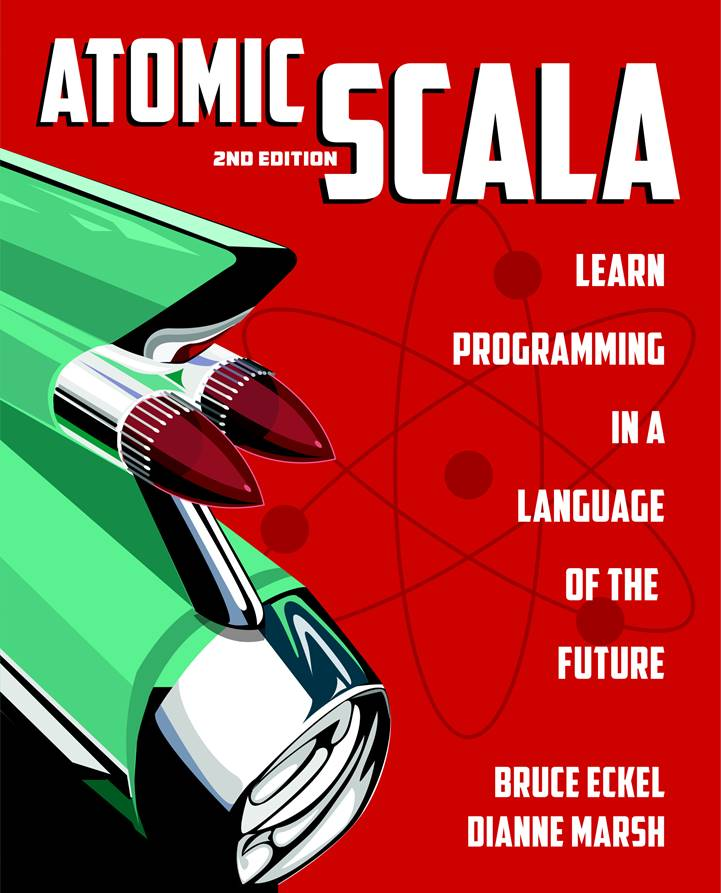

<style scoped>
h1, h2, h3, h4, h5, h6 {
  color: black;
}
a {
  color: black;
  text-decoration: none;
}
</style>


# Polymorphism<br/>Unbound

## Bruce Eckel

###### Github:<br/> BruceEckel/PolymorphismUnbound

---

## `cfront`, `virtual`, and dynamic binding


---

# How did we get here?

## Simula

- A simulation needs a common interface for all simulation elements.
- So you can tell them all to update themselves.

---

# Smalltalk

- Takes Simula concept and applies it to all elements
- Code Reuse via Inheritance
* BUT Smalltalk is inherently dynamic
* _Message-Oriented Programming_ (like Actors)

---

# C++

  - Encapsulation for data control
  - Inheritance and dynamic binding
  - Objects are completely optional
  - Everything statically typed for safety

---

# Java

  - Not optional: Everything is an Object, like Smalltalk
  - BUT static typing makes it quite different
  - The concept of dynamic messages is lost, not really like Smalltalk
  - Reusing code through inheritance didn't really work out
  - Post-Java languages have learned from its mistakes

---
<style scoped>
h2 {
  color: orange;
}
</style>
# Polymorphism
<br/><br/>
## _A type represents multiple types_
<br/><br/>
Usually appears in the form of a function parameter

---

# Examples

- Different forms of polymorphism
- Implemented in different languages:

---

# Java

(_without reflection_)
www.OnJava8.com


---

# C++


---

# Kotlin

www.AtomicKotlin.com


---

<style scoped>
h1, h2, h3, h4, h5, h6 {
  color: black;
}
</style>
### www.AtomicScala.com



---

# Python, Rust, Go

---

# Ad-Hoc Polymorphism (Overloading)

---

```kt
//: src/kotlin/src/main/kotlin/AdHoc.kt

fun f(s: String) = println("f(String): $s")

fun f(f: Float) = println("f(Float): $f")

fun main() {
    f("hi")
    f(42.24f)
}
```
------

```cpp
//: src/cpp/AdHoc.cpp
// All C++ examples tested with https://cpp.sh
#include <string>
#include <iostream>
using namespace std;

void f(string s) {
    cout << "f(string): " << s << endl;
}

void f(float f) {
    cout << "f(float): " << f << endl;
}

int main() {
    f("hi");
    f(42.24);
}
```
------

```java
//: src/java/src/DisjointTypes.java
class Dog {
  void gulp() {
    System.out.println("eating dog food");
  }
  void bark() {
    System.out.println("woof");
  }
}

class Person {
  void scarf() {
    System.out.println("eating pizza");
  }
  void greet() {
    System.out.println("hello");
  }
}
```
---
```java
class Robot {
  void charge() {
    System.out.println("charging");
  }
  void initiate() {
    System.out.println("operational");
  }
}

class Slug {
  void absorb() {
    System.out.println("eating grass");
  }
}
```
---
```java
public class DisjointTypes {
  static void nourish(Dog subject) {
    subject.gulp();
    subject.bark();
  }
  static void nourish(Person subject) {
    subject.scarf();
    subject.greet();
  }
  static void nourish(Robot subject) {
    subject.charge();
    subject.initiate();
  }
  static void nourish(Slug subject) {
    subject.absorb();
  }
  ```
---
```java
  public static void main(String... args) {
    // Ad-hoc polymorphism (overloading):
    nourish(new Dog());
    nourish(new Person());
    nourish(new Robot());
    nourish(new Slug());
    // (Statically determined at compile time)
  }
}
```
------


- Python overloading: `src/python/single_dispatch.py`

---

# Classic Inheritance following Liskov Substitution

---

```kt
//: src/kotlin/src/main/kotlin/Inheritance.kt
package inheritance

interface Base {
    fun eat()
    fun speak()
}

class Dog: Base {
    override fun eat() = println("eating dog food")
    override fun speak() = println("woof")
}

class Person: Base {
    override fun eat() = println("eating pizza")
    override fun speak() = println("hello")
}
```
---
```kt
class Robot: Base {
    override fun eat() = println("charging")
    override fun speak() = println("operational")
}

class Slug: Base {
    override fun eat() = println("eating grass")
    override fun speak() = Unit
}

fun nourish(subject: Base) {
    subject.eat()
    subject.speak()
}

fun main() = listOf(
    Dog(), Person(), Robot(), Slug()
).forEach { nourish(it) }
```
------

```scala
//: src/scala/Inheritance.scala
package inheritance

trait Base:
    def eat(): Unit
    def speak(): Unit

class Dog extends Base:
    def eat() = println("eating dog food")
    def speak() = println("woof")

class Person extends Base:
    def eat() = println("eating pizza")
    def speak() = println("hello")
```
---
```scala
class Robot extends Base:
    def eat() = println("charging")
    def speak() = println("operational")

class Slug extends Base:
    def eat() = println("eating grass")
    def speak() = {}

def nourish(x: Base): Unit =
    x.eat()
    x.speak()

@main def main() =
    List(Dog(), Person(), Robot(), Slug()).foreach(nourish(_))
```
------

```java
//: src/java/src/Inheritance.java
package inheritance;
import java.util.List;

interface Base {
  void eat();
  void speak();
}

class Dog implements Base {
  @Override
  public void eat() { System.out.println("eating dog food"); }
  @Override
  public void speak() { System.out.println("woof"); }
}
```
---
```java
class Person implements Base {
  @Override
  public void eat() { System.out.println("eating pizza"); }
  @Override
  public void speak() { System.out.println("hello"); }
}

class Robot implements Base {
  @Override
  public void eat() { System.out.println("charging"); }
  @Override
  public void speak() { System.out.println("operational"); }
}
```
---
```java
class Slug implements Base {
  @Override
  public void eat() { System.out.println("eating grass"); }
  @Override
  public void speak() {}
}

public class Inheritance {
  static void nourish(Base subject) {
    subject.eat();
    subject.speak();
  }
  public static void main(String... args) {
    List.of(
        new Dog(), new Person(), new Robot(), new Slug()
    ).forEach(Inheritance::nourish);
  }
}
```
------

```cpp
//: src/cpp/Inheritance.cpp
#include <iostream>
using namespace std;

class Base {
    public:
    virtual void eat() = 0;  // Pure virtual == abstract
    virtual void speak() = 0;
};

class Dog: public Base {
    public:
    void eat() override { cout << "eating dog food" << endl; }
    void speak() override { cout << "woof"  << endl; }
};
```
---
```cpp
class Person: public Base {
    public:
    void eat() override { cout << "eating pizza" << endl; }
    void speak() override { cout << "hello"  << endl; }
};

class Robot: public Base {
    public:
    void eat() override { cout << "charging" << endl; }
    void speak() override { cout << "operational" << endl; }
};

class Slug: public Base {
    public:
    void eat() override { cout << "eating grass"  << endl; }
    void speak() override {}
};
```
---
```cpp
void nourish(Base* base) {
    base->eat();
    base->speak();
}

int main() {
    Base* subjects[] = { new Dog(), new Person(), new Robot(), new Slug() };
    for(Base* subject: subjects)
      nourish(subject);
}
```
------

```py
#: src/python/base.py
from abc import ABC, abstractmethod

class Base(ABC):
    @abstractmethod
    def eat(self) -> None: ...
    @abstractmethod
    def speak(self) -> None: ...
```
------

```py
#: src/python/inheritance.py
from base import Base

class Dog(Base):
    def eat(self): print("eating dog food")
    def speak(self): print("woof")

class Person(Base):
    def eat(self): print("eating pizza")
    def speak(self): print("hello")
```
---
```py
class Robot(Base):
    def eat(self): print("charging")
    def speak(self): print("operational")

class Slug(Base):
    def eat(self): print("eating grass")
    def speak(self): pass

def nourish(subject: Base):
    subject.eat()
    subject.speak()

if __name__ == '__main__':
    for subject in [Dog(), Person(), Robot(), Slug()]:
        nourish(subject)
```
------

```rs
//: src/rust/inheritance/src/main.rs
struct Dog;
struct Person;
struct Robot;
struct Slug;

trait Base {
  fn eat(&self);
  fn speak(&self);
}

impl Base for Dog {
  fn eat(&self) { println!("eating dog food"); }
  fn speak(&self) { println!("woof"); }
}

impl Base for Person {
  fn eat(&self) { println!("eating pizza"); }
  fn speak(&self) { println!("hello"); }
}
```
---
```rs
impl Base for Robot {
  fn eat(&self) { println!("charging"); }
  fn speak(&self) { println!("operational"); }
}

impl Base for Slug {
  fn eat(&self) { println!("eating grass"); }
  fn speak(&self) {}
}

fn main() {
  let v: Vec<&dyn Base> = vec![&Dog{}, &Person{}, &Robot{}, &Slug{}];
  for d in v.iter() {
    d.eat();
    d.speak();
  }
}
```
------


# Multiple Inheritance

---

```kt
//: src/kotlin/src/main/kotlin/DisjointTypes.kt
open class Dog {
    fun gulp() = println("eating dog food")
    fun bark() = println("woof")
}

open class Person {
    fun scarf() = println("eating pizza")
    fun greet() = println("hello")
}

open class Robot {
    fun charge() = println("charging")
    fun initiate() = println("operational")
}

open class Slug {
    fun absorb() = println("eating grass")
}
```
------

```kt
//: src/kotlin/src/main/kotlin/MultipleInheritance.kt
// Can also do this in Java

interface Base {
    fun eat()
    fun speak() {}
}

class Dog2 : Base, Dog() {
    override fun eat() = gulp()
    override fun speak() = bark()
}

class Person2 : Base, Person() {
    override fun eat() = scarf()
    override fun speak() = greet()
}
```
---
```kt
class Robot2 : Base, Robot() {
    override fun eat() = charge()
    override fun speak() = initiate()
}

class Slug2 : Base, Slug() {
    override fun eat() = absorb()
}

fun nourish(subject: Base) {
    subject.eat()
    subject.speak()
}

fun main() = listOf(
    Dog2(), Person2(), Robot2(), Slug2()
).forEach { nourish(it) }
```
------

```kt
//: src/kotlin/src/main/kotlin/Composition.kt
// Can use this approach in most languages

class Dog3 : Base {
    private val dog = Dog()
    override fun eat() = dog.gulp()
    override fun speak() = dog.bark()
}

class Person3 : Base {
    private val person = Person()
    override fun eat() = person.scarf()
    override fun speak() = person.greet()
}
```
---
```kt
class Robot3 : Base {
    private val robot = Robot()
    override fun eat() = robot.charge()
    override fun speak() = robot.initiate()
}

class Slug3 : Base {
    private val slug = Slug()
    override fun eat() = slug.absorb()
}

fun main() = listOf(
    Dog3(), Person3(), Robot3(), Slug3()
).forEach { nourish(it) }
```
------

```kt
//: src/kotlin/src/main/kotlin/Delegation.kt

class Delegate(b: Base) : Base by b {
    fun consume() = eat()
    fun report() = speak()
}

fun nourish2(d: Delegate) {
    d.consume()
    d.report()
}

fun main() = listOf(
    Delegate(Dog3()), Delegate(Person3()), Delegate(Robot3()), Delegate(Slug3())
).forEach { nourish2(it) }
```
------

```cpp
//: src/cpp/MultipleInheritance.cpp
// Combining disjoint types using MI
#include <iostream>
using namespace std;

class Dog {
    public:
    void gulp() { cout << "eating dog food" << endl; }
    void bark() { cout << "woof"  << endl; }
};

class Person {
    public:
    void scarf() { cout << "eating pizza" << endl; }
    void greet() { cout << "hello"  << endl; }
};
```
---
```cpp
class Robot {
    public:
    void charge() { cout << "charging" << endl; }
    void initiate() { cout << "operational" << endl; }
};

class Slug {
    public:
    void absorb() { cout << "eating grass"  << endl; }
};
```
---
```cpp
class Base {
    public:
    virtual void eat() = 0;  // Pure virtual function
    virtual void speak() = 0;
};

class Dog2: public Base, private Dog {
    public:
    void eat() override { gulp(); }
    void speak() override { bark(); }
};
```
---
```cpp
class Person2: public Base, private Person {
    public:
    void eat() override { scarf(); }
    void speak() override { greet(); }
};

class Robot2: public Base, private Robot {
    public:
    void eat() override { charge(); }
    void speak() override { initiate(); }
};

class Slug2: public Base, private Slug {
    public:
    void eat() override { absorb(); }
    void speak() override {}
};
```
---
```cpp
void nourish(Base* base) {
    base->eat();
    base->speak();
}

int main() {
    Base* subjects[] = { new Dog2(), new Person2(), new Robot2(), new Slug2() };
    for(Base* subject: subjects)
      nourish(subject);
}
```
------

```py
#: src/python/disjoint_types.py
class Dog:
    def eat(self): print("eating dog food")
    def bark(self): print("woof")

class Person:
    def eat(self): print("eating pizza")
    def greet(self): print("hello")

class Robot:
    def eat(self): print("charging")
    def initiate(self): print("operational")

class Slug:
    def eat(self): print("eating grass")
```
------

```py
#: src/python/multiple_inheritance.py
from base import Base
from disjoint_types import Dog, Person, Robot, Slug

class Dog2(Dog, Base): # Order of base classes is important
    def eat(self): super().eat()
    def speak(self): self.bark()

class Person2(Person, Base):
    def eat(self): super().eat()
    def speak(self): self.greet()

class Robot2(Robot, Base):
    def eat(self): super().eat()
    def speak(self): self.initiate()

class Slug2(Slug, Base):
    def eat(self): super().eat()
    def speak(self): pass  # Required by ABC
```
---
```py
def nourish(base: Base):
    base.eat()
    base.speak()

if __name__ == '__main__':
    for subject in [Dog2(), Person2(), Robot2(), Slug2()]:
        nourish(subject)
```
------


# Parametric Polymorphism

---

```java
//: src/java/src/Generics.java
package generics;

class Holder<T> {
  private T value = null;
  void set(T x) { value = x;}
  T get() { return value; }
}

interface Base {
  void speak();
}

class Dog implements Base {
  @Override
  public void speak() {
    System.out.println("woof");
  }
}
```
---
```java
class Person implements Base {
  @Override
  public void speak() {
    System.out.println("hello");
  }
}

public class Generics {
  public static void main(String... args) {
    var dogHolder = new Holder<Dog>();
    dogHolder.set(new Dog());
    Dog d = dogHolder.get();
    // dogHolder.set(new Person());  // Nope
    var baseHolder = new Holder<Base>();
    baseHolder.set(new Dog());
    baseHolder.set(new Person());
    // Person p = baseHolder.get();  // Nope
    Base b = baseHolder.get();
  }
}
```
------

```kt
//: src/kotlin/src/main/kotlin/Generics.kt

fun <T> nourish(subject: T) : T {
    when (subject) {
        is Dog -> {
            subject.gulp()
            subject.bark()
        }
        is Person -> {
            subject.scarf()
            subject.greet()
        }
        is Robot -> {
            subject.charge()
            subject.initiate()
        }
        is Slug -> {
            subject.absorb()
        }
    }
    return subject
}
```
---
```kt
fun main() {
    listOf(
        Dog(), Person(), Robot(), Slug()
    ).map { nourish(it) }.forEach{ println(it) }
    val d: Dog = nourish(Dog())
    println(d)
}
```
------

```go
//: src/golang/generic/generics.go
package main

type Dog struct{}

func (dog Dog) Eat()  { println("eating dog food") }
func (dog Dog) Bark() { println("woof") }

type Person struct{}

func (person Person) Eat()   { println("eating pizza") }
func (person Person) Greet() { println("hello") }
```
---
```go
type Robot struct{}

func (robot Robot) Eat()      { println("charging") }
func (robot Robot) Initiate() { println("operational") }

type Slug struct{}

func (slug Slug) Eat() { println("eating grass") }
```
---
```go
type Eater interface {
    Eat()
}
// T is a Union type:
func Poly[T Dog | Person | Robot | Slug](subject T) {
    switch subjectTyped := any(subject).(type) {
    case Eater:
        subjectTyped.Eat()
    }
    switch subjectTyped := any(subject).(type) {
    case Dog:
        subjectTyped.Bark()
    case Person:
        subjectTyped.Greet()
    case Robot:
        subjectTyped.Initiate()
    }  // Not exhaustive
}
```
---
```go
func main() {
    Poly(Dog{})
    Poly(Person{})
    Poly(Robot{})
    Poly(Slug{})
}
```
------


Scala & Rust?

---

# Structural Typing aka Duck Typing

---

```py
#: src/python/duck_typing.py
from disjoint_types import Dog, Person, Robot, Slug

def nourish(subject):
    subject.eat()  # Duck typing
    if type(subject) is Dog: subject.bark()
    if type(subject) is Person: subject.greet()
    if type(subject) is Robot: subject.initiate()

if __name__ == '__main__':
    for subject in [Dog(), Person(), Robot(), Slug()]:
        nourish(subject)
        # nourish("")  # Runtime error
```
------

```cpp
//: src/cpp/StructuralTyping.cpp
#include <variant>  // C++ 17
#include <iostream>
using namespace std;

class Dog {
    public:
    void eat() { cout << "eating dog food" << endl; }
};

class Person {
    public:
    void eat() { cout << "eating pizza" << endl; }
};
```
---
```cpp
class Robot {
    public:
    void eat() { cout << "charging" << endl; }
};

class Slug {
    public:
    void eat() { cout << "eating grass"  << endl; }
};
```
---
```cpp
// 'Structural typing' aka 'duck typing'
template <class T>
void nourish(T subject) {
    subject.eat();
}

int main() {
    nourish(Dog());
    nourish(Person());
    nourish(Robot());
    nourish(Slug());
}
```
------


# Union Types aka Sum Types

---

```py
#: src/python/union_types.py
from disjoint_types import Dog, Person, Robot, Slug

def nourish(sumtype_obj: Dog | Person | Robot | Slug):
    sumtype_obj.eat()
    match sumtype_obj:  # No exhaustiveness checking
        case Dog(): sumtype_obj.bark()
        case Person(): sumtype_obj.greet()
        case Robot(): sumtype_obj.initiate()

if __name__ == '__main__':
    for subject in [Dog(), Person(), Robot(), Slug()]:
        nourish(subject)
    # nourish("")  # Type-check error
```
------

```scala
//: src/scala/DisjointTypes.scala
// Nothing in common
package disjointtypes

class Dog:
    def eat() = println("eating dog food")
    def bark() = println("woof")

class Person:
    def scarf() = println("eating pizza")
    def talk() = println("hello")

class Robot:
    def charge() = println("charging")
    def communicate() = println("operational")

class Slug:
    def absorb() = println("eating grass")
```
------

```scala
//: src/scala/UnionTypes.scala
// Union types aka sum types
package uniontypes
import disjointtypes.*

// 'x' is a union type:
def nourish(x: Dog | Person | Robot | Slug) = x match
    case d: Dog =>
        d.eat()
        d.bark()
    case p: Person =>
        p.scarf()
        p.talk()
    case r: Robot =>
        r.charge()
        r.communicate()
    case s: Slug =>
        s.absorb()
```
---
```scala
@main def main() =
    val list: List[Dog | Person | Robot | Slug] =
        List(Dog(), Person(), Robot(), Slug())
    list.foreach(nourish(_))
```
------

```java
// src/java/src/PatternMatching.java
// {NewFeature} Preview in JDK 17
// Compile with javac flags:
//   --enable-preview --source 17
import java.util.List;

class Hedgehog {
  void groom() {}
  void walk() {}
}

class Fish {
  void feed() {}
  void changeWater() {}
}
```
---
```java
public class PatternMatching {
  static void careFor(Object p) {  // No union types
    switch(p) { // Exhaustive except for Null
      case Hedgehog d -> {
        d.groom();
        d.walk();
      }
      case Fish f -> {
        f.feed();
        f.changeWater();
      }
      // case null -> {} // Not required
      case default -> {}
    };
  }
  public static void main(String... args) {
    List.of(new Hedgehog(), new Fish())
        .forEach(PatternMatching::careFor);
  }
}
```
------

```cpp
//: src/cpp/UnionTypes.cpp
#include <variant>  // C++ 17
#include <iostream>
using namespace std;

class Dog {
    public:
    void gulp() { cout << "eating dog food" << endl; }
    void bark() { cout << "woof"  << endl; }
};

class Person {
    public:
    void scarf() { cout << "eating pizza" << endl; }
    void greet() { cout << "hello"  << endl; }
};

class Robot {
    public:
    void charge() { cout << "charging" << endl; }
    void initiate() { cout << "operational" << endl; }
};

class Slug {
    public:
    void absorb() { cout << "eating grass"  << endl; }
};
```
---
```cpp
// sumTypeObj is a 'union type':
void nourish(variant<Dog, Person, Robot, Slug> sumTypeObj) {
    if(auto dogPtr(get_if<Dog>(&sumTypeObj)); dogPtr) {
        dogPtr->gulp();
        dogPtr->bark();
    }
    else if(auto personPtr(get_if<Person>(&sumTypeObj)); personPtr) {
        personPtr->scarf();
        personPtr->greet();
    }
    else if(auto robotPtr(get_if<Robot>(&sumTypeObj)); robotPtr) {
        robotPtr->charge();
        robotPtr->initiate();
    }
    // No exhaustiveness checking
}

int main() {
    typedef variant<Dog, Person, Robot, Slug> Disjoint;
    Disjoint subjects[] = { Dog(), Person(), Robot(), Slug() };
    for(Disjoint subject: subjects)
      nourish(subject);
}
```
------


# Protocols

---

```py
#: src/python/protocols.py
from typing import Protocol

class Dog:
    def eat(self): print("eating dog food")
    def speak(self): print("woof")

class Person:
    def eat(self): print("eating pizza")
    def speak(self): print("hello")

class Robot:
    def eat(self): print("charging")
    def speak(self): print("operational")
```
---
```py
class Slug:
    def eat(self): print("eating grass")
    def speak(self): pass

class Base(Protocol):
    def eat(self): ...
    def speak(self): ...

def nourish(subject: Base):
    subject.eat()
    subject.speak()

if __name__ == '__main__':
    for subject in [Dog(), Person(), Robot(), Slug()]:
        nourish(subject)
```
------

```go
//: src/golang/structural/structural.go
package main

type Dog struct{}

func (dog Dog) Eat()     { println("eating dog food") }
func (dog Dog) Speak() { println("woof") }

type Person struct{}

func (person Person) Eat()     { println("eating pizza") }
func (person Person) Speak() { println("hello") }
```
---
```go
type Robot struct{}

func (robot Robot) Eat()     { println("charging") }
func (robot Robot) Speak() { println("operational") }

type Slug struct{}

func (slug Slug) Eat()     { println("eating grass") }
func (slug Slug) Speak() {}
```
---
```go
type EaterSpeaker interface {
    Eat()
    Speak()
}

func Nourish(x EaterSpeaker) {
    x.Eat()
    x.Speak()
}

func main() {
    subjects := []EaterSpeaker{
        Dog{}, Person{}, Robot{}, Slug{},
    }
    for _, subject := range subjects {
        Nourish(subject)
    }
}
```
------


# Algebraic Data Types (ADTs)

---

```scala
//: src/scala/EnumeratedDataTypes.scala
// Enumerated Data Types
package enumtypes
import EnumType.*

enum EnumType:
    case Dog, Person, Robot, Slug
    def eat() = this match
        case Dog => println("eating dog food")
        case Person => println("eating pizza")
        case Robot => println("charging")
        case Slug => println("eating grass")
    def speak() = this match
        case Dog => println("woof")
        case Person => println("hello")
        case Robot => println("operational")
        case Slug => ()
```
---
```scala
def nourish(x: EnumType): Unit =
    x.eat()
    x.speak()

@main def main() =
    List(Dog, Person, Robot, Slug).foreach(nourish(_))
```
------

```scala
//: src/scala/EnumeratedDataTypes2.scala
package enumtypes2
import EnumType.*

enum EnumType(food: String, talk: String):
    case Dog extends EnumType("eating dog food", "woof")
    case Person extends EnumType("eating pizza", "hello")
    case Robot extends EnumType("charging", "operational")
    case Slug extends EnumType("eating grass", "")
    def eat() = println(food)
    def speak() = println(talk)

def nourish(x: EnumType): Unit =
    x.eat()
    x.speak()

@main def main() =
    List(Dog, Person, Robot, Slug).foreach(nourish(_))
```
------

```scala
//: src/scala/AlgebraicDataTypes.scala
package adts
import ADT.*

enum ADT(food: String, talk: String):
    case Dog(says: String) extends ADT("eating dog food", says)
    case Person(says: String) extends ADT("eating pizza", says)
    case Robot extends ADT("charging", "operational")
    case Slug extends ADT("eating grass", "")
    def eat() = println(food)
    def speak() = println(talk)

def nourish(x: ADT): Unit =
    x.eat()
    x.speak()

@main def main() =
    List(Dog("woof"), Person("hi!"), Robot, Slug).foreach(nourish(_))
```
------

```kt
//: src/kotlin/src/main/kotlin/AlgebraicDataTypes.kt
package algebraic
import algebraic.ADT.*

sealed class ADT(val eats: String) {
    fun eat() = println("eating $eats")

    class Dog(food: String = "dog food") : ADT(food) {
        fun bark() { println("woof") }
    }
    class Person(food: String) : ADT(food) {
        fun greet() { println("hello") }
    }
    class Robot : ADT("electricity") {
        fun initiate() { println("operational") }
    }
    class Slug(food: String) : ADT(food)
}
```
---
```kt
fun nourish(subject: ADT) {
    subject.eat()
    when (subject) {
        is Dog -> subject.bark()
        is Person -> subject.greet()
        is Robot -> subject.initiate()
        is Slug -> {}
    }
}

fun main() = listOf(
    Dog(), Person("pizza"),
    Robot(), Slug("grass")
).forEach { nourish(it) }
```
------


# Type Classes

---

```scala
//: src/scala/TypeClasses.scala
// "Automating the adapter pattern"
package typeclasses
import disjointtypes.*

trait EaterSpeaker[T]:
    extension (t: T)
        def eat(): Unit
        def speak(): Unit

given EaterSpeaker[Dog] with
    extension (t: Dog)
        def eat(): Unit = t.eat()
        def speak(): Unit = t.bark()
```
---
```scala
given EaterSpeaker[Person] with
    extension (t: Person)
        def eat(): Unit = t.scarf()
        def speak(): Unit = t.talk()

given EaterSpeaker[Robot] with
    extension (t: Robot)
        def eat(): Unit = t.charge()
        def speak(): Unit = t.communicate()

given EaterSpeaker[Slug] with
    extension (t: Slug)
        def eat(): Unit = t.absorb()
        def speak() = {}
```
---
```scala
def nourish[T](x: T)(using EaterSpeaker[T]): Unit =
    x.eat()
    x.speak()

@main def main() =
    nourish(Dog())
    nourish(Person())
    nourish(Robot())
    nourish(Slug())
```
------

```rs
//: src/rust/typeclasses/src/main.rs

struct Dog;
impl Dog {
    fn bark(&self) {
        println!("woof");
    }
}

struct Person;
impl Person {
    fn greet(&self) {
        println!("hello");
    }
}
```
---
```rs
pub trait Communicate {
    fn speak(&self);
}

impl Communicate for Dog {
    fn speak(&self) {
        self.bark();
    }
}

impl Communicate for Person {
    fn speak(&self) {
        self.greet();
    }
}
```
---
```rs
pub fn talk<T: Communicate>(x: &T) {
    x.speak();
}

fn main() {
    talk(&Dog {});
    talk(&Person {});
}
```
------


# Takeaways

* Why do we want to treat multiple types as the same type?
  * Separate things that change from things that stay the same?
  * Reduce code duplication?
  * Code understanding & maintenance?
  * Don't do it without question

---

# What can we do with the aggregate?

* If there's no intersection of either syntax or semantics, does it make sense?
* Yes: erasure in Java allows no behavior, only preserves exact return type

---

# Code Reuse with Inheritance

* Maybe conflating these should have been left to Smalltalk
  * Some newer languages (Rust, Go) explicitly disallow it
  * Code reuse means embedding an object rather than inheriting
  * Luciano Ramalho: implement interfaces only for "frameworks"

---

# Was OO a Mistake?

* No: Sometimes it's quite useful
* Just not everywhere all the time
  * Forcing inheritance into every design seems like a bad idea
* Ad-hoc polymorphism is heavily used in FP: map, fold, etc.

---

# I'll Get By With a Little Help...

- James Ward
- Luciano Ramalho
- Bill Frasure
- Jack Leow
- Marshall Pierce
- Bill Venners

---

# Questions

