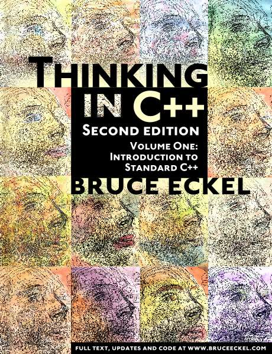

<style scoped>
h1, h2, h3, h4, h5, h6 {
  color: black;
}
a {
  color: black;
  text-decoration: none;
}
</style>


# Polymorphism<br/>Unbound

## Bruce Eckel

###### Github:<br/> BruceEckel/PolymorphismUnbound

---

## `cfront`, `virtual`, and dynamic binding


---

# How did we get here?

## Simula

- A simulation needs a common interface for all simulation elements.
- So you can tell them all to update themselves.

---

# Smalltalk

- Takes Simula concept and applies it to all elements
- Code Reuse via Inheritance
* BUT Smalltalk is inherently dynamic
* _Message-Oriented Programming_ (like Actors)

---

# C++

  - Encapsulation for data control
  - Inheritance and dynamic binding
  - Objects are completely optional
  - Everything statically typed for safety

---

# Java

  - Not optional: Everything is an Object, like Smalltalk
  - BUT static typing makes it quite different
  - The concept of dynamic messages is lost, not really like Smalltalk
  - Reusing code through inheritance didn't really work out
  - Post-Java languages have learned from its mistakes

---
<style scoped>
h2 {
  color: orange;
}
</style>
# Polymorphism

## &nbsp;&nbsp;&nbsp;&nbsp;&nbsp;&nbsp;&nbsp; _A type represents multiple types_

* Usually appears in the form of a function parameter
* Modifying types vs. modifying functions

---

# Examples

- Different forms of polymorphism
- Implemented in different languages:

---

# Kotlin

www.AtomicKotlin.com


---

# Java

www.OnJava8.com


---

# C++



---

<style scoped>
h1, h2, h3, h4, h5, h6 {
  color: black;
}
</style>
### www.AtomicScala.com


---

## Python: 25 years
## Rust, Go: Hours

---

# Ad-Hoc Polymorphism (Overloading)

```
f("hello")

f(42.24)
```

---

```
//: src/kotlin/src/main/kotlin/disjoint/DisjointTypes.kt           [Kotlin]
package disjoint

open class Person {
    fun consume() = println("eating pizza")
}

open class Robot {
    fun charge() = println("charging")
}
```
------

```
//: src/kotlin/src/main/kotlin/AdHoc.kt                            [Kotlin]
import disjoint.*

fun nourish(p: Person) = p.consume()

fun nourish(r: Robot) = r.charge()

fun main() {
    nourish(Person())
    nourish(Robot())
}
```
------


# Overloading in Other Languages

- Java: `src/java/src/AdHoc.java`
- C++: `src/cpp/AdHoc.cpp`
- Python: `src/python/single_dispatch.py`

---

# Subtype Polymorphism

- "Classic" inheritance
- Follows the Liskov Substitution Principle

---

```
//: src/kotlin/src/main/kotlin/Inheritance.kt                      [Kotlin]
package inheritance

interface Base {
    fun eat()
}

class Person: Base {
    override fun eat() = println("eating pizza")
}

class Robot: Base {
    override fun eat() = println("charging")
}

fun nourish(subject: Base) = subject.eat()

fun main() = listOf(Person(), Robot()).forEach { nourish(it) }
```
------


  - Scala: `src/scala/Inheritance.scala`
  - Java: `src/java/src/Inheritance.java`
  - C++: `src/cpp/Inheritance.cpp`
  <!-- - `src/python/base.py` -->
  - Python: `src/python/inheritance.py`

---

# Multiple Inheritance

---

```
//: src/kotlin/src/main/kotlin/MultipleInheritance.kt              [Kotlin]
// Can also do this in Java
import disjoint.*

interface Base {
    fun eat()
}

class Person2 : Base, Person() {
    override fun eat() = consume()
}

class Robot2 : Base, Robot() {
    override fun eat() = charge()
}

fun nourish(subject: Base) = subject.eat()

fun main() = listOf(Person2(), Robot2()).forEach { nourish(it) }
```
------

```
//: src/kotlin/src/main/kotlin/Composition.kt                      [Kotlin]
// Can use this approach in most languages
import disjoint.*

class Person3 : Base {
    private val person = Person()
    override fun eat() = person.consume()
}

class Robot3 : Base {
    private val robot = Robot()
    override fun eat() = robot.charge()
}

fun main() = listOf(Person3(), Robot3()).forEach { nourish(it) }
```
------

<!-- |==> //: src/kotlin/src/main/kotlin/Delegation.kt -->
```
//: src/cpp/MultipleInheritance.cpp                                   [C++]
// Combining disjoint types using MI
#include <iostream>
using namespace std;

class Person {
    public:
    void consume() { cout << "eating pizza" << endl; }
};

class Robot {
    public:
    void charge() { cout << "charging" << endl; }
};

class Base {
    public:
    virtual void eat() = 0;  // Pure virtual function
};
```
---
```
class Person2: public Base, private Person {
    public:
    void eat() override { consume(); }
};

class Robot2: public Base, private Robot {
    public:
    void eat() override { charge(); }
};

void nourish(Base* base) {
    base->eat();
}

int main() {
    Base* subjects[] = { new Person2(), new Robot2() };
    for(Base* subject: subjects)
      nourish(subject);
}
```
------

<!-- |==> #: src/python/multiple_inheritance.py -->

# Parametric Polymorphism (Generics)

```
class Holder<T> ...

Holder<Car>(car)
Holder<Robot>(robot)
Holder<List<Car>>(listOf(car))
```

---

```
//: src/kotlin/src/main/kotlin/Holder.kt                           [Kotlin]

class Holder<T>(private val value: T) {
    fun get(): T = value
}

fun main() {
    class Car; class Robot

    val car = Car()
    val garage = Holder<Car>(car)
    val c: Car = garage.get()

    val robot = Robot()
    val chargingStation = Holder<Robot>(robot)
    val r: Robot = chargingStation.get()

    val carList = Holder<List<Car>>(listOf(car))
}
```
------

```
//: src/kotlin/src/main/kotlin/GenericFunctions.kt                 [Kotlin]
package generics
import disjoint.*

fun <T> nourish(subject: T) : T {
    when (subject) {
        is Person -> subject.consume()
        is Robot -> subject.charge()
    }
    return subject
}

fun nourish2(subject: Any) : Any {
    when (subject) {
        is Person -> subject.consume()
        is Robot -> subject.charge()
    }
    return subject
}
```
---
```
fun main() {
    listOf(Person(), Robot())
        .map { nourish(it) }.forEach{ println(it) }
    val r: Robot = nourish(Robot())

    // val p: Person = nourish2(Person()) // Nope
    val o: Any = nourish2(Person())
}
```
------


- Java: `src/java/src/Generics.java`
- Kotlin has reified generics

---

# Structural Typing <br/>(Duck Typing)

---

```
#: src/python/duck_typing.py                                       [Python]
class Person:
    def eat(self): print("eating pizza")

class Robot:
    def eat(self): print("charging")

def nourish(subject: object):
    subject.eat()  # Duck typing

if __name__ == '__main__':
    for subject in [Person(), Robot()]:
        nourish(subject)
    # nourish("")  # Runtime error
```
------

```
//: src/cpp/StructuralTyping.cpp                                      [C++]
#include <variant>  // C++ 17
#include <iostream>
using namespace std;

class Person {
    public:
    void eat() { cout << "eating pizza" << endl; }
};

class Robot {
    public:
    void eat() { cout << "charging" << endl; }
};
```
---
```
// 'Structural typing' aka 'duck typing'
template <class T>
void nourish(T subject) {
    subject.eat();
}

int main() {
    nourish(Person());
    nourish(Robot());
}
```
------


# Union Types

- aka Sum Types

```
Type1 | Type2 | Type3 | ...
```

- New for many people so I'll spend more time on it

---

```
#: src/python/disjoint_types.py                                    [Python]

class Person:
    def consume(self): print("eating pizza")

class Robot:
    def charge(self): print("charging")
```
------

```
#: src/python/union_types.py                                       [Python]
from disjoint_types import Person, Robot

def nourish(x: Person | Robot):
    match x:  # No exhaustiveness checking (yet)
        case Person(): x.consume()
        case Robot(): x.charge()

if __name__ == '__main__':
    for subject in [Person(), Robot()]:
        nourish(subject)
    # nourish("")  # Type-check error
```
------

```
//: src/scala/DisjointTypes.scala                                   [Scala]
package disjointtypes

class Person:
    def consume() = println("eating pizza")

class Robot:
    def charge() = println("charging")
```
------

```
//: src/scala/UnionTypes.scala                                      [Scala]
// Union types aka sum types
package uniontypes
import disjointtypes.*

def nourish(x: Person | Robot) = x match
    case p: Person => p.consume()
    case r: Robot  => r.charge()

@main def main() =
    val list: List[Person | Robot] = List(Person(), Robot())
    list.foreach(nourish)
```
------

```
//: src/golang/uniontypes/uniontypes.go                                [Go]
package main

type Person struct{}

func (person Person) Consume() { println("eating pizza") }

type Robot struct{}

func (robot Robot) Charge() { println("charging") }
```
---
```
func Nourish[T Person | Robot](subject T) {
    switch subjectTyped := any(subject).(type) {
    case Person:
        subjectTyped.Consume()
//  case Robot:
//    subjectTyped.Charge()
    } // Not exhaustive
}

func main() {
    Nourish(Person{})
    Nourish(Robot{})
    // Nourish("")  // Compile-time error
}
```
------


- C++: `src/cpp/UnionTypes.cpp` (Not pretty)

---

# Protocols

---

```
//: src/golang/structural/structural.go                                [Go]
package main

type Person struct{}

func (person Person) Consume() { println("eating pizza") }

type Robot struct{}

func (robot Robot) Consume() { println("charging") }

```
---
```
type Consumer interface {
    Consume()
}

func Nourish(x Consumer) {
    x.Consume()
}

func main() {
    subjects := []Consumer{Person{}, Robot{}}
    for _, subject := range subjects {
        Nourish(subject)
    }
}
```
------


- Python: `src/python/protocols.py`

---

# Algebraic Data Types (ADTs)

---

```
//: src/scala/EnumeratedDataTypes.scala                             [Scala]
// Enumerated Data Types
package enumtypes
import EnumType.*

enum EnumType:
    case Person, Robot
    def eat() = this match
        case Person => println("eating pizza")
        case Robot => println("charging")

def nourish(x: EnumType) = x.eat()

@main def main() = List(Person, Robot).foreach(nourish)
```
------

```
//: src/scala/AlgebraicDataTypes.scala                              [Scala]
package adts
import ADT.*

enum ADT:
    case Person(val eats: String)
    case Robot(val chargesWith: String)

def nourish(x: ADT) = x match   // Exhaustive
    case p: Person => println(s"eating ${p.eats}")
    case r: Robot  => println(s"charging with ${r.chargesWith}")

@main def main() =
    List(Person("pizza"), Robot("electricity")).foreach(nourish)
```
------


- Kotlin: `src/kotlin/src/main/kotlin/AlgebraicDataTypes.kt`

# Type Classes

---

```
//: src/scala/TypeClasses.scala                                     [Scala]
// "Automating the adapter pattern"
package typeclasses
import disjointtypes.*

trait EaterSpeaker[T]:
    extension (t: T)
        def eat(): Unit

given EaterSpeaker[Person] with
    extension (t: Person)
        def eat(): Unit = t.consume()
```
---
```
given EaterSpeaker[Robot] with
    extension (t: Robot)
        def eat(): Unit = t.charge()

def nourish[T](x: T)(using EaterSpeaker[T]): Unit =
    x.eat()

@main def main() =
    nourish(Person())
    nourish(Robot())
```
------

```
//: src/rust/typeclasses/src/main.rs                                 [Rust]
struct Person;
struct Robot;

impl Person {
  fn consume(&self) { println!("eating pizza"); }
}

impl Robot {
  fn charge(&self) { println!("charging"); }
}
```
---
```
pub trait Eater {
    fn eat(&self);
}

impl Eater for Person {
    fn eat(&self) {
        self.consume();
    }
}

impl Eater for Robot {
    fn eat(&self) {
        self.charge();
    }
}
```
---
```
pub fn nourish<T: Eater>(x: &T) {
    x.eat();
}

fn main() {
    nourish(&Person {});
    nourish(&Robot {});
}
```
------


# Multiple Dispatching

- Some versions of Lisp
- Julia

---

# Inheritance for Code-Reuse

- We seem to be moving away from this

---

```
//: src/rust/inheritance/src/main.rs                                 [Rust]
struct Person;
struct Robot;

trait Base {
  fn eat(&self);
}

impl Base for Person {
  fn eat(&self) { println!("eating pizza"); }
}

impl Base for Robot {
  fn eat(&self) { println!("charging"); }
}

fn main() {
  let v: Vec<&dyn Base> = vec![&Person{}, &Robot{}];
  for d in v.iter() {
    d.eat();
  }
}
```
------


- Go only allows interface-implementation

---

# Takeaways

* Why do we want to treat multiple types as the same type?
  * Separate things that change from things that stay the same?
  * Reduce code duplication?
  * Capturing & reusing common concepts
  * Don't do it without question

---

# What can we do with the aggregate?

* If there's no intersection of either syntax or semantics, does it make sense?
* Yes: erasure on the JVM allows no behavior, only preserves exact return type

---

# Code Reuse with Inheritance

* Maybe conflating these should have been left to Smalltalk
  * Have I used more than one level of inheritance? (except examples)
  * Some newer languages (Rust, Go) explicitly disallow it
  * Code reuse means embedding an object rather than inheriting
  * Luciano Ramalho: implement interfaces only for "frameworks"

---

# Was OO a Mistake?

* No: Sometimes it's quite useful
* Just not everywhere all the time
  * Forcing inheritance into every design seems like a bad idea
* Ad-hoc polymorphism is heavily used in FP: map, fold, etc.

---

# I'll Get By With a Little Help...

- Bill Frasure
- James Ward
- Luciano Ramalho
- Jack Leow
- Marshall Pierce
- Bill Venners

---

# Questions

... In the hall

