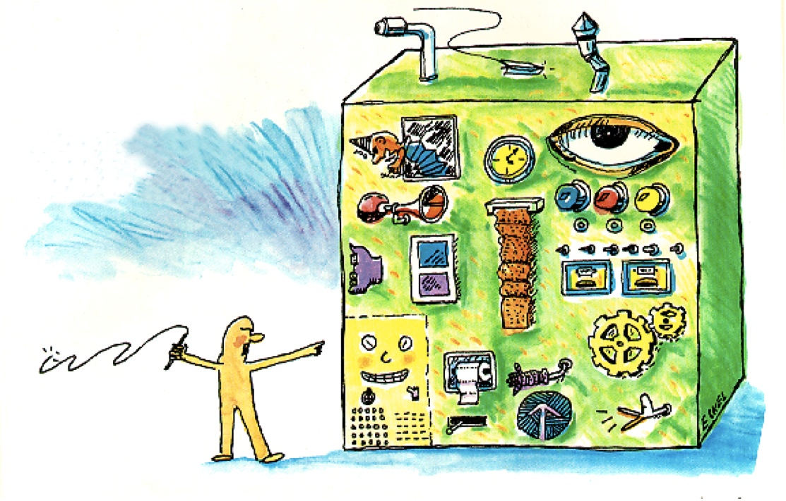
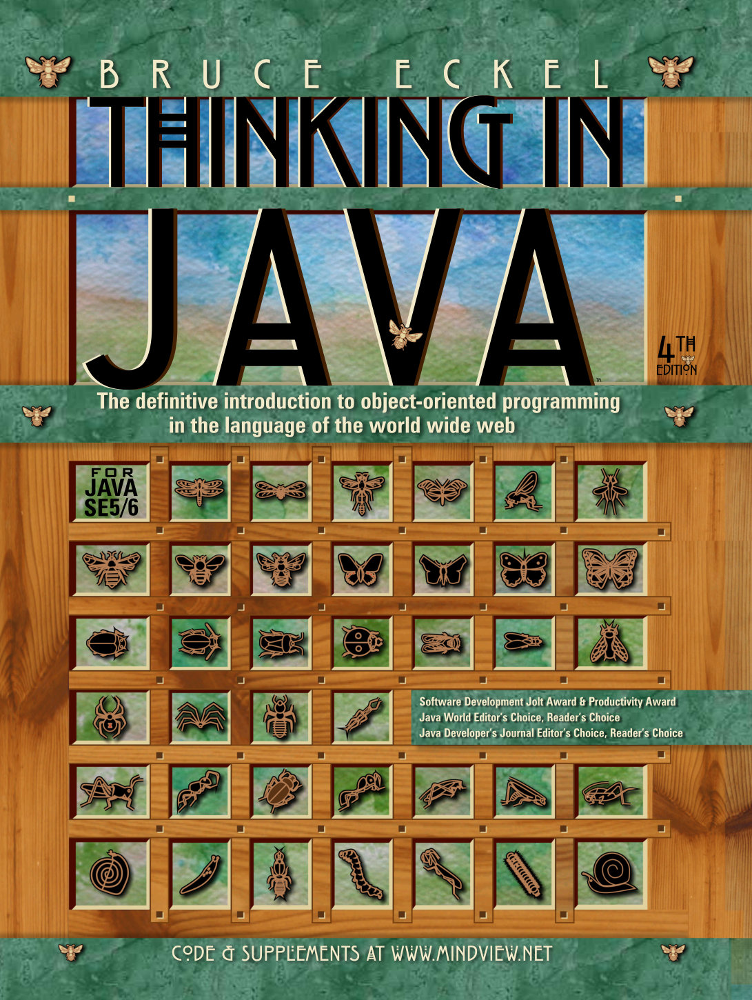
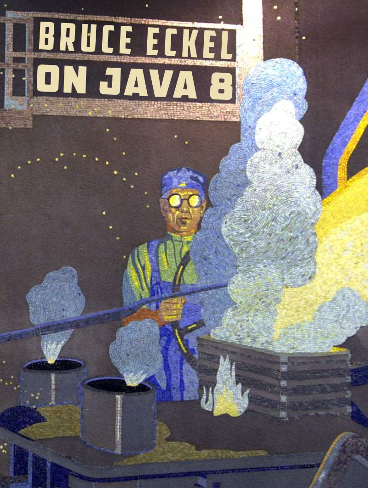
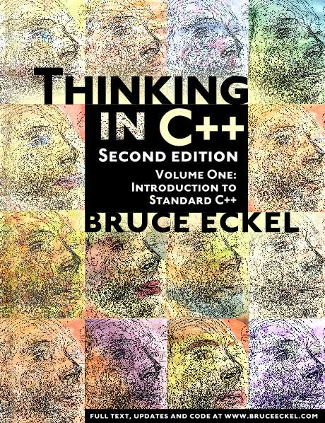
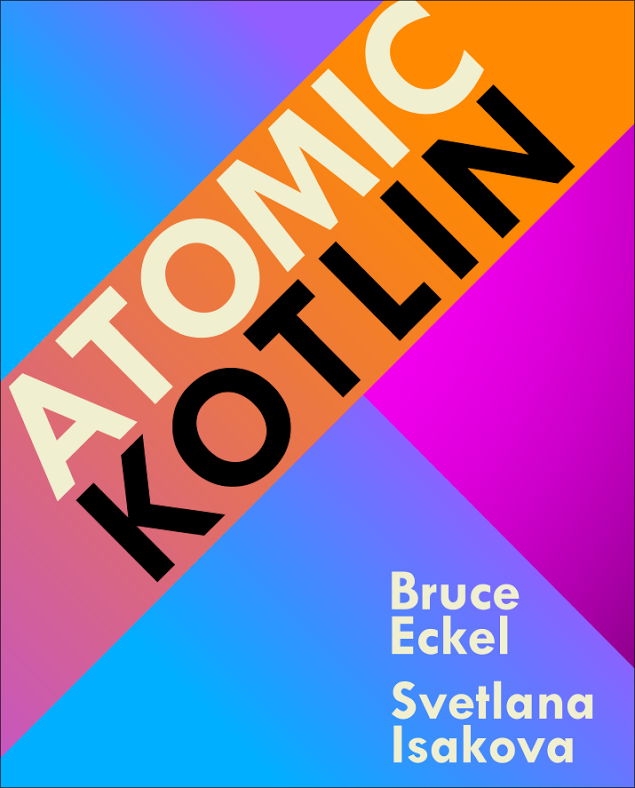
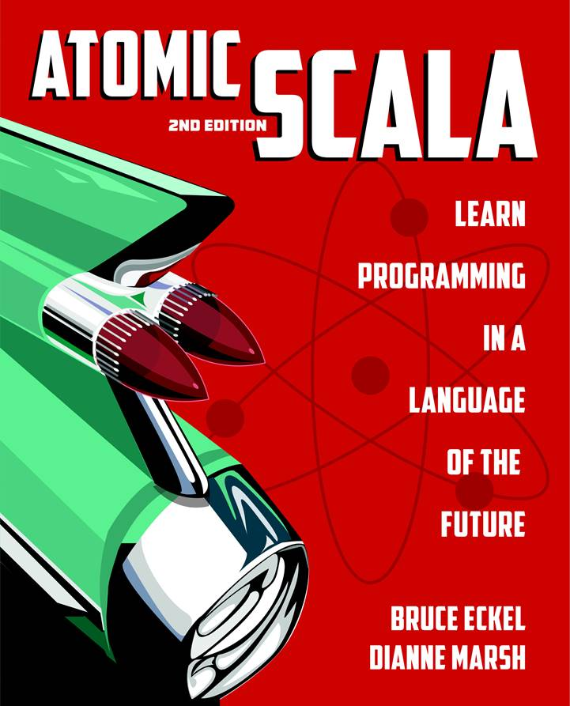
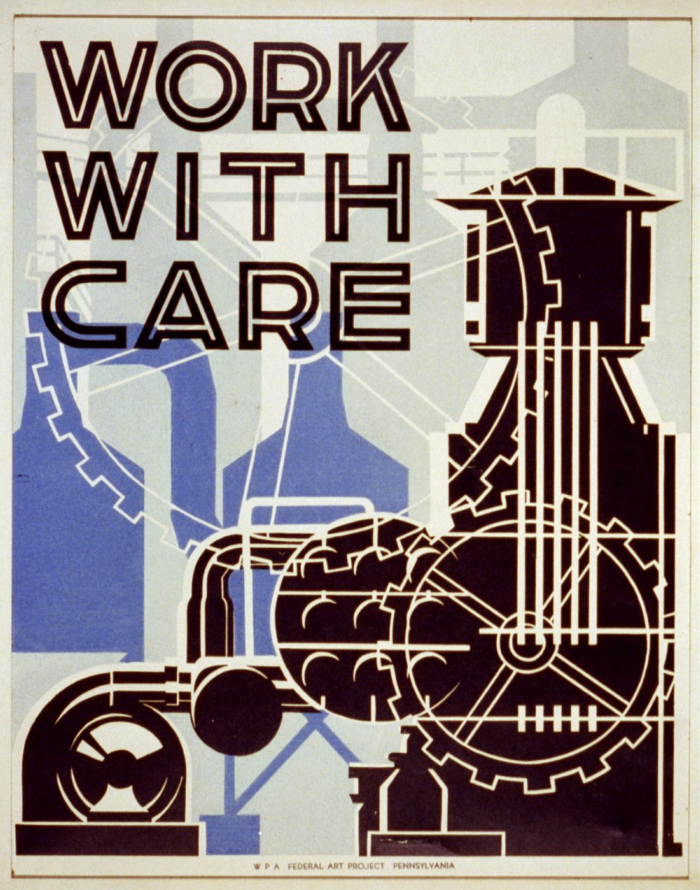

# Polymorphism Unbound

## Bruce Eckel

###### Github:  BruceEckel/PolymorphismUnbound

---

## `cfront`, `virtual`, and dynamic binding

---

# How did we get here?

## Simula

- A simulation needs a common interface for all simulation elements.
- So you can tell them all to update themselves.

---

# Smalltalk

- Takes Simula concept and applies it to all elements
- Code Reuse via Inheritance
* BUT Smalltalk is inherently dynamic
* _Message-Oriented Programming_ (like Actors)

---

# C++

  - Encapsulation for data control
  - Inheritance and dynamic binding
  - Objects are completely optional
  - Everything statically typed for safety

---

# Java

  - Not optional: Everything is an Object, like Smalltalk
  - BUT static typing makes it quite different
  - The concept of dynamic messages is lost, not really like Smalltalk
  - Reusing code through inheritance didn't really work out
  - Post-Java languages have learned from its mistakes

---

# Polymorphism
  
## _A type represents multiple types_
  
Usually appears in the form of a function parameter

---

# Examples

- Different forms of polymorphism
- Implemented in different languages:

---

# Java

(_without reflection_)
www.OnJava8.com

---

# C++

---

# Kotlin

www.AtomicKotlin.com

---

### www.AtomicScala.com

---

# Python, Rust, Go

---

# Ad-Hoc Polymorphism (Overloading)

---

|==> //: src/kotlin/src/main/kotlin/AdHoc.kt
|==> //: src/cpp/AdHoc.cpp
|==> //: src/java/src/DisjointTypes.java

- Python added overloading
- Example in Github repo: `src/python/single_dispatch.py`

---

# Classic Inheritance following Liskov Substitution

---

|==> //: src/kotlin/src/main/kotlin/Inheritance.kt
|==> //: src/scala/Inheritance.scala
|==> //: src/java/src/Inheritance.java
|==> //: src/cpp/Inheritance.cpp
|==> #: src/python/base.py
|==> #: src/python/inheritance.py
|==> //: src/rust/inheritance/src/main.rs

# Multiple Inheritance

---

|==> //: src/kotlin/src/main/kotlin/DisjointTypes.kt
|==> //: src/kotlin/src/main/kotlin/MultipleInheritance.kt
|==> //: src/kotlin/src/main/kotlin/Composition.kt
|==> //: src/kotlin/src/main/kotlin/Delegation.kt
|==> //: src/cpp/MultipleInheritance.cpp
|==> #: src/python/disjoint_types.py
|==> #: src/python/multiple_inheritance.py

# Parametric Polymorphism

---

|==> //: src/java/src/Generics.java
|==> //: src/kotlin/src/main/kotlin/ReifiedGenerics.kt
|==> //: src/golang/generic/generics.go

Scala & Rust?

---

# Structural Typing aka Duck Typing

---

|==> #: src/python/duck_typing.py
|==> //: src/cpp/StructuralTyping.cpp

# Union Types aka Sum Types

---

|==> #: src/python/union_types.py
|==> //: src/scala/DisjointTypes.scala
|==> //: src/scala/UnionTypes.scala
|==> // src/java/src/PatternMatching.java
|==> //: src/cpp/UnionTypes.cpp

# Protocols

---

|==> #: src/python/protocols.py
|==> //: src/golang/structural/structural.go

# Algebraic Data Types (ADTs)

---

|==> //: src/scala/EnumeratedDataTypes.scala
|==> //: src/scala/EnumeratedDataTypes2.scala
|==> //: src/scala/AlgebraicDataTypes.scala
|==> //: src/kotlin/src/main/kotlin/AlgebraicDataTypes.kt

---

# Type Classes

---

|==> //: src/scala/TypeClasses.scala
|==> //: src/rust/typeclasses/src/main.rs

# Takeaways

* Why do we want to treat multiple types as the same type?
  * Separate things that change from things that stay the same?
  * Reduce code duplication?
  * Code understanding & maintenance?
  * Don't do it without question

---

# What can we do with the aggregate?

* If there's no intersection of either syntax or semantics, does it make sense?
* Yes: erasure in Java allows no behavior, only preserves exact return type

---

# Code Reuse with Inheritance

* Maybe conflating these should have been left to Smalltalk
  * Some newer languages (Rust, Go) explicitly disallow it
  * Code reuse means embedding an object rather than inheriting
  * Luciano Ramalho: implement interfaces only for "frameworks"

---

# Was OO a Mistake?

* No: Sometimes it's quite useful
* Just not everywhere all the time
  * Forcing inheritance into every design seems like a bad idea
* Ad-hoc polymorphism is heavily used in FP: map, fold, etc.

---

# I'll Get By With a Little Help...

- James Ward
- Luciano Ramalho
- Bill Frasure
- Jack Leow
- Marshall Pierce
- Bill Venners

---

# Questions

